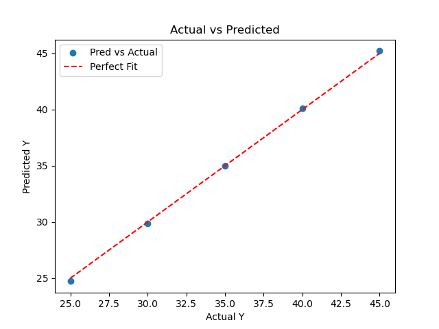

# 📦 Linear Regression From Scratch (Multivariate)

A beginner-friendly implementation of **Multivariate Linear Regression using Gradient Descent**, built completely from scratch using **Python, NumPy, and Matplotlib**.

This project helps you understand how machine learning models work internally without using libraries like Scikit-Learn.

---

## 🚀 Features

* Multivariate Linear Regression (multiple features)
* Gradient Descent optimization
* Vectorized NumPy implementation
* Cost/Loss tracking over epochs
* Predict new values
* Visualization of training progress
* Actual vs Predicted comparison plot
* Clean object-oriented design

---

## 📂 Project Structure

```bash
📦Linear-Regression-From-Scratch
 ┣ 📜main.py
 ┣ 📜README.md
 ┣ 📜CostReduction.png
 ┗ 📜RegressionPlot.png
```

---

## 🧠 Model Overview

This implementation supports **multiple input features**:

### Prediction Formula

```text
y_pred = w1*x1 + w2*x2 + ... + wn*xn + b
```

In vector form:

```text
y_pred = X · w + b
```

Where:

* `X` = input feature matrix
* `w` = weight vector
* `b` = bias term

---

## 📉 Cost Function (MSE)

We minimize the Mean Squared Error:

```text
Cost = (1 / 2m) * Σ (y_pred - y)^2
```

Where:

* `m` = number of samples

---

## 📊 Gradient Descent Update Rules

```text
dw = (1/m) * Xᵀ (y_pred - y)
db = (1/m) * Σ (y_pred - y)

w = w - learning_rate * dw
b = b - learning_rate * db
```

---

## ▶️ Installation

```bash
git clone https://github.com/maroofiums/Linear-Regression-Form-Scratch.git
<<<<<<< Updated upstream
=======
<<<<<<< HEAD
cd Linear-Regression-From-Scratch

=======
>>>>>>> Stashed changes
cd Linear-Regression-Form-Scratch
>>>>>>> 9bc484d813e5f8d70874bbff31cde583cf6ee8c0
pip install numpy matplotlib
```

---

## ▶️ Usage

Run the model:

```bash
python main.py
```

---

## 📊 Example Dataset

This model supports multiple features:

```python
X = [
    [1, 6],
    [2, 7],
    [3, 8],
    [4, 9],
    [5, 10]
]
```

Target values:

```python
y = [25, 30, 35, 40, 45]
```

---

## 🎯 Learning Objective

This project teaches you:

* How regression works internally
* Gradient Descent optimization
* Vectorized computation with NumPy
* Loss minimization process
* Multi-feature linear modeling
* Core ML math foundations

---

## 📈 Example Output

```bash
Epoch: 0 - Cost: ...
Epoch: 100 - Cost: ...
Epoch: 200 - Cost: ...

Final Parameters:
(weights, bias)

Prediction: [[value]]
```

---

## 📉 Visualizations

### 🔹 Cost Reduction Over Time

Shows how loss decreases during training:


---

### 🔹 Actual vs Predicted

Shows model performance:



---

## 🧠 Key Improvements in This Version

Compared to basic linear regression:

* Supports **multiple features**
* Fully **vectorized implementation**
* More realistic ML workflow
* Better visualization tools
* Closer to real-world ML models

---

## 🔥 Future Improvements

* R² Score
* Feature Scaling
* Train/Test Split
* Model Serialization
* Compare with Scikit-Learn